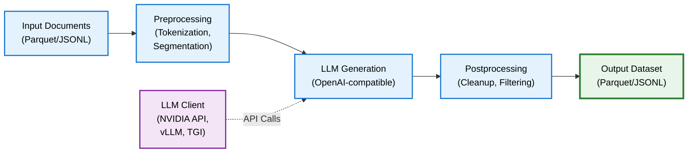

# Synthetic Data Generation

NeMo Curator provides synthetic data generation (SDG) capabilities for creating and augmenting training data using Large Language Models (LLMs). These pipelines integrate with OpenAI-compatible APIs, enabling you to use NVIDIA NIM endpoints, local vLLM servers, or other inference providers.

## Use Cases

- **Data Augmentation**: Expand limited datasets by generating diverse variations
- **Multilingual Generation**: Create Q&A pairs and text in multiple languages
- **Knowledge Extraction**: Convert raw text into structured knowledge formats
- **Quality Improvement**: Paraphrase low-quality text into higher-quality Wikipedia-style prose
- **Training Data Creation**: Generate instruction-following data for model fine-tuning

## Core Concepts

Synthetic data generation in NeMo Curator operates in two primary modes:

### Generation Mode

Create new data from scratch without requiring input documents. The `QAMultilingualSyntheticStage` demonstrates this pattern—it generates Q&A pairs based on a prompt template without needing seed documents.

### Transformation Mode

Improve or restructure existing data using LLM capabilities. The Nemotron-CC stages exemplify this approach, taking input documents and producing:

- Paraphrased text in Wikipedia style
- Diverse Q&A pairs derived from document content
- Condensed knowledge distillations
- Extracted factual content

## Architecture

The following diagram shows how SDG pipelines process data through preprocessing, LLM generation, and postprocessing stages:



## Prerequisites

Before using synthetic data generation, ensure you have:

1. **NVIDIA API Key** (for cloud endpoints)
   - Obtain from [NVIDIA Build](https://build.nvidia.com/settings/api-keys)
   - Set as environment variable: `export NVIDIA_API_KEY="your-key"`

2. **NeMo Curator with text extras**

   ```bash
   uv pip install --extra-index-url https://pypi.nvidia.com nemo-curator[text_cuda12]
   ```

   <Note>
   Nemotron-CC pipelines use the `transformers` library for tokenization, which is included in NeMo Curator's core dependencies.
   </Note>

## Available SDG Stages

| Stage | Purpose | Input Type |
| --- | --- | --- |
| `QAMultilingualSyntheticStage` | Generate multilingual Q&A pairs | Empty (generates from scratch) |
| `WikipediaParaphrasingStage` | Rewrite text as Wikipedia-style prose | Document text |
| `DiverseQAStage` | Generate diverse Q&A pairs from documents | Document text |
| `DistillStage` | Create condensed, information-dense paraphrases | Document text |
| `ExtractKnowledgeStage` | Extract knowledge as textbook-style passages | Document text |
| `KnowledgeListStage` | Extract structured fact lists | Document text |

---

## Topics

<Cards>

<Card title="LLM Client Setup" href="/curate-text/synthetic/llm-client">
Configure OpenAI-compatible clients for NVIDIA APIs and custom endpoints
configuration
performance
</Card>

<Card title="Multilingual Q&A Generation" href="/curate-text/synthetic/multilingual-qa">
Generate synthetic Q&A pairs across multiple languages
quickstart
tutorial
</Card>

<Card title="Nemotron-CC Pipelines" href="/curate-text/synthetic/nemotron-cc">
Advanced text transformation and knowledge extraction workflows
advanced
paraphrasing
</Card>

</Cards>
